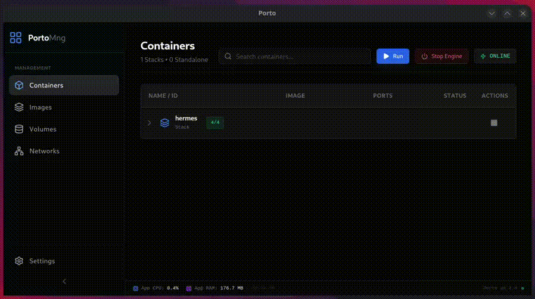

# Porto

<div align="center">
  
  
  <h3>The Native, Lightweight Docker Manager.</h3>
  
  <p>
    Manage Containers, Images, Volumes, and Networks with zero overhead.
    <br />
    Built for performance using <strong>Rust</strong> and <strong>SolidJS</strong>.
  </p>

  <a href="https://github.com/yourusername/porto/blob/main/LICENSE">
    
  </a>
  
  
  
</div>

---


## 📖 Overview

**Porto** is a modern desktop client for managing Docker environments. It was born from the frustration of using resource-heavy Electron-based management tools on Linux. 

Unlike traditional solutions that spin up heavy virtual machines or consume gigabytes of RAM just to render a UI, Porto connects directly to your local Docker socket (or Podman, or remote SSH) using a native Rust backend. It is designed to be **invisible** until you need it, consuming negligible resources while providing a powerful, real-time dashboard.

## ✨ Key Features

### 📦 Container Management
* **Full Lifecycle Control:** Start, Stop, Restart, and Kill containers instantly.
* **Real-time Logs:** High-performance log streaming with ANSI color support.
* **Interactive Terminal:** Full TTY shell access (`/bin/sh`) directly inside the app.
* **Live Stats:** Real-time CPU and Memory usage visualization with dynamic charts.
* **Deep Inspection:** View environment variables, port mappings, and network details in a clean UI.

### 🛠️ Resources & Maintenance
* **Image Management:** Pull new images, view build history (layers), and clean up dangling images.
* **Volume & Network CRUD:** Create, inspect, and delete volumes and networks with ease.
* **System Prune:** A dedicated "magic broom" tool to reclaim disk space by cleaning unused resources.

### 🔌 Universal Connectivity
* **Engine Agnostic:** Works seamlessly with **Docker Native**, **Docker Desktop**, and **Podman**.
* **Remote Management:** Connect to remote servers via TCP or SSH sockets.
* **Hot-Swapping:** Switch between different contexts/sockets instantly without restarting the app.

---

## 🏗️ Architecture

Porto is built on the **Tauri v2** framework, leveraging a hybrid architecture that combines the safety and speed of Rust with the reactivity of SolidJS.

### Event-Driven Design (The Core)
Instead of constantly asking the Docker Daemon "Is anything new?", Porto uses a reactive **Event Stream**.

1.  **The Listener:** On startup, the Rust backend spawns a lightweight thread that subscribes to the Docker Engine events channel.
2.  **The Trigger:** When a container dies, starts, or updates, Docker sends a signal.
3.  **The Reaction:** Rust intercepts this signal and emits a Tauri Event to the frontend.
4.  **The Update:** The frontend (via TanStack Query) immediately invalidates the relevant cache, causing the UI to reflect the change instantly.

```mermaid
sequenceDiagram
    participant Docker as Docker Engine
    participant Rust as Rust Backend (Tauri)
    participant UI as SolidJS Frontend

    Note over Rust, Docker: Permanent Event Stream Connection
    
    Docker->>Rust: Event: "die" (Container X)
    activate Rust
    Rust->>UI: emit("docker-event")
    deactivate Rust
    
    activate UI
    UI->>UI: Invalidate Query Cache
    UI->>Rust: invoke("list_containers")
    Rust->>Docker: List Containers
    Docker-->>Rust: [Container List Data]
    Rust-->>UI: JSON Data
    UI->>UI: Re-render Component
    deactivate UI
````

### Resource Usage & Polling

To maintain efficiency, **polling (periodic fetching)** is strictly limited to specific use cases where event streams are not available or practical:

  * **Container Stats:** We stream `docker stats` only when the user opens the "Stats" tab. The connection closes immediately when the tab is closed.
  * **Connection Recovery:** If the connection to the socket is lost, a "Circuit Breaker" activates, and a lightweight poller checks for the socket's reappearance every few seconds to auto-reconnect.

-----

## 💻 Tech Stack

### Backend (Rust)

  * **[Tauri](https://tauri.app/):** The application framework.
  * **[Bollard](https://www.google.com/search?q=https://github.com/frewsxcv/bollard):** An asynchronous Docker client library for Rust.
  * **[Tokio](https://tokio.rs/):** Asynchronous runtime for handling streams and heavy I/O.
  * **[Sysinfo](https://crates.io/crates/sysinfo):** Used to monitor the application's own resource footprint.

### Frontend (TypeScript)

  * **[SolidJS](https://www.solidjs.com/):** For a compiled, signal-based, and ultra-fast UI.
  * **[TanStack Query](https://tanstack.com/query/latest):** For async state management and caching.
  * **[TailwindCSS](https://tailwindcss.com/):** For styling and the dark-mode design system.
  * **[Xterm.js](https://xtermjs.org/):** For the integrated terminal emulator.
  * **[Solid ApexCharts](https://apexcharts.com/):** For real-time metric visualization.

-----

## 🚀 Getting Started

### Prerequisites

  * **Bun** (or Node.js)
  * **Rust** (cargo)
  * **Docker** (or Podman) running locally.

### Installation

1.  **Clone the repository:**

    ```bash
    git clone https://github.com/julipinto/porto.git
    cd porto
    ```

2.  **Install dependencies:**

    ```bash
    bun install
    ```

3.  **Run in Development Mode:**

    ```bash
    bun tauri dev
    ```

### Building for Production

To create an optimized executable/installer for your OS:

```bash
bun tauri build
```

The output will be available in `src-tauri/target/release/bundle`.

-----

## 🗺️ Roadmap

  - [x] Core Container Lifecycle (Start/Stop/Remove)
  - [x] Real-time Logs & Stats
  - [x] Universal Socket Support (Docker/Podman/Remote)
  - [x] Image, Volume and Network Management
  - [x] **Container Creation Wizard** (Form-based `docker run`)
  - [x] **Port Forwarding** for Remote Contexts
  - [ ] **Docker Compose** Support (Run `docker-compose.yml` files)
  - [ ] **Light Theme** support

-----

## 🤝 Contributing

Contributions are welcome\! Whether it's a bug report, a new feature suggestion, or a pull request, feel free to contribute.

1.  Fork the Project
2.  Create your Feature Branch (`git checkout -b feature/AmazingFeature`)
3.  Commit your Changes (`git commit -m 'Add some AmazingFeature'`)
4.  Push to the Branch (`git push origin feature/AmazingFeature`)
5.  Open a Pull Request

-----

## 📄 License

Distributed under the MIT License. See `LICENSE` for more information.
